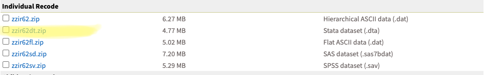

## Introduction 

The purpose of this document is to provide step-by-step instructions and code for analyzing the [Demographic and Healthy Surveys Model Data](https://www.dhsprogram.com/data/Download-Model-Datasets.cfm), which can then be extended to analyzing specific country DHS data. DHS data is collected using population-based survey and includes a wide range of variables providing information about population health, reproductive health, child health, and more for countries around the globe. In this example, we use the 'Individual Recode' data file and provide all code in R. This resource is structured as follows.

## Contents

### 1) Prepare Your Data

Learn how to read in data, clean data, and create new variables.  

### 2) Describe Your Data

Learn how to summarize and visualize your data. Learn how to use sampling weights and stratification to present your summaries.  

### 3) Model Your Data  

Learn how to conduct epidemiologic analyses using linear and logistic regression and hypothesis testing.  


# 1) Prepare Your Data  

Begin by navigating to the [Demographic and Healthy Surveys Model Data](https://www.dhsprogram.com/data/Download-Model-Datasets.cfm) page and downloading the 'Individual Recode' data file shown below (ZZIR62FL.DTA). Save this file to your working directory.



Use the following code to read the data into your R environment:  

```{r}
#install.packages("haven")
library(haven)
dhs <- read_dta("ZZIR62FL.DTA")
```

Use the View command to open your data into a viewing window. Here, you can see labels for each variable and the first rows of data. 

```{r, eval = F}
View(dhs)
### dhs$v119
#dhs$d101a
dhs$v763a
dhs$v312
dhs$v812
sum(as.numeric(is.na(dhs$v632)))
nrow(dhs)
dhs$v632a
dhs$v822
```

