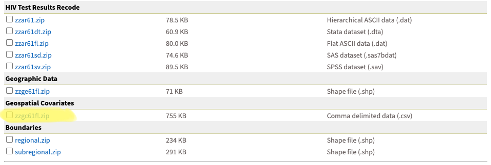

```{=html}
<style type="text/css">

h1.title {
  font-size: 50px;
  color: DarkRed;
}

</style>
```

{width="50%"} {width="40%"}

## Introduction

The purpose of this document is to provide step-by-step instructions and code for analyzing the [Demographic and Healthy Surveys Model Data](https://www.dhsprogram.com/data/Download-Model-Datasets.cfm), which can then be extended to analyzing specific country DHS data. DHS data is collected using population-based survey and includes a wide range of variables providing information about population health, reproductive health, child health, and more for countries around the globe. The model dataset is de-identified, re-weighted, and imputed (where missing) data intended to educational purposes. In this example, we use the 'Individual Recode' data file and provide all code in R.

## Research Objective

Throughout this demo, we explore the research question: **What is the impact of gender norms on health outcomes?** More specifically, we explore outcomes related to domestic violence and contraceptive use, which have direct impact on one's mental, physical, and sexual health. We use predictors related to gender roles and customs in the home, which are further explained in the *Describe Your Data* section. While this research question is one example of how to use DHS data, the methods and code we provided can be extended to other analyses. We present foundational steps for working with different types of variables, plotting data, and modeling relationships, which are important skills for many analyses. We hope this resource will be of use to those interested in answering their own questions using the DHS data.

This resource is structured as follows.

## Contents

### 1) Prepare Your Data

Learn how to read in data to your R environment and create a subset according to your analysis.

### 2) Describe Your Data

Learn how to summarize and visualize your data. Learn how to use sampling weights and stratification to present your summaries. Learn how to create new variables from existing ones and merge with other datasets. 

### 3) Model Your Data

Learn how to conduct epidemiologic analyses using linear and logistic regression and hypothesis testing.

# 1) Prepare Your Data

Begin by navigating to the [Demographic and Healthy Surveys Model Data](https://www.dhsprogram.com/data/Download-Model-Datasets.cfm) page and downloading the 'Individual Recode' data file shown below (ZZIR62FL.DTA). Save this file to your working directory.


Next, we will prepare our R environment. The following packages are required for this analysis. You can install them using the install.packages("package_name") function, and load them using the library() function.

```{r, message = F, warning = F}
# Install packages once if needed:
# install.packages(c("haven","dplyr","tidyverse","ggplot2","scales","survey","broom","janitor", "srvyr")))

library(haven)     # read DHS .DTA files
library(dplyr)     # data wrangling
library(tidyverse) # ggplot2 + tidy tools
library(ggplot2)   # plotting
library(scales)    # percent labels
library(srvyr)     # survey-weighted analysis
library(survey)    # survey-weighted analysis
library(broom)     # tidy model output
library(janitor)   # quick frequency tables
library(stringr)   # pattern matching for variable names
library(forcats)   # factor ordering
library(knitr)     # presenting tables
```

Use the following code to read the data into your R environment:

```{r}
dhs <- read_dta("ZZIR62FL.DTA")
```

Use the View command to open your data into a viewing window. Here, you can see labels for each variable and the first rows of data.

```{r, eval = F}
View(dhs)
```

Throughout your analysis, you can use the DHS [codebook manual](https://www.dhsprogram.com/pubs/pdf/DHSG4/Recode7_DHS_10Sep2018_DHSG4.pdf) to refer to each variable and its coding structure. You can also use the following code to access the labels for a desired variable.

```{r}
dhs$v744a[[2]]
```

# 2) Describe Your Data

DHS data is survey data, meaning it comes from a sample of the population we desire to make inferences on, but we cannot survey every individual in the population. To account for this, we use sampling weights. Each individual is assigned a sampling weight that reflects how many people in the population that individual represents. When we use these weights in our analysis, we can make estimates that are more representative of the population. In this section, we will demonstrate how to use sampling weights to create weighted tables and plots. We will also show how to create new variables from existing ones and how to merge with other datasets.  

## Sampling Weights  

First, we need to set up our sampling weight variable by dividing it by 1,000,000 as DHS protocol states. THen we can use the svydesign() function to specify the survey design, which includes the primary sampling unit (PSU), strata, and weights. The PSU is the cluster variable (v001) and the weights are in the variable v005. In this survey, clusters are a group of 20-30 households in the same region. 

```{r}
dhs$v005 <- dhs$v005 / 1000000 # rescale weights to be on the order of 1 instead of 1 million

dhs_surv <- svydesign(
  ids = ~caseid,
  strata = ~v001,
  weights = ~v005,
  data = dhs 
)
```

Now that we have set up our survey design, we will introduce the variables used in our analysis and demonstrate how to create weighted tables and plots. 

## Outcomes

**1. Domestic Violence** - variable code D105A-N, D106-D108. These variables account for all instances of physical domestic violence. Here is an example of D105D, "spouse ever kicked or dragged." These are categorical variables.

```{r}
dhs$d105d[[2]]
```

Because these domestic violence variables come from survey questions asked only to women in union/are married (V502), we will restrict our data to the subset of women who are married for the remainder of the analysis:

```{r, echo = F}
dhs <- dhs %>%
  filter(v502 == 1)
```

```{r}
dhs_surv <- subset(dhs_surv, v502 == 1)
```

Now we can create a weighted table showing the response distribution for this question:

```{r, warning = F}
kable(svytable(~d105d, design = dhs_surv) %>%
  prop.table() %>%
  { . * 100 } %>%
  round(digits = 2), col.names = c("Spouse ever kicked or dragged", "Percent"))
```

We can also present this information in a plot. 

```{r, echo = F, fig.show = "hide"}
dhs$d105d_factor <- as_factor(dhs$d105d) # convert to factor variable to get the labels for the bar plot

ggplot(dhs, aes(x = d105d_factor)) +
  geom_bar() +
  labs(
    x = "Response",
    y = "Count",
    title = "Spouse ever kicked or dragged") + 
  theme(axis.text.x = element_text(angle = 45, hjust = 1))
```

```{r}
dhs_df <- as.data.frame(svytable(~d105d, design = dhs_surv))
ggplot(dhs_df, aes(x = d105d, y = Freq)) +
  geom_bar(stat = "identity") +
  labs(
    x = "Response",
    y = "Count",
    title = "Spouse ever kicked or dragged (survey-weighted)"
  ) + 
  theme(axis.text.x = element_text( hjust = 1))
```


Since we have several variables representing domestic violence, we can combine them to create a single binary variable indicating any physical domestic violence:  

```{r, echo = F}
# restrict analysis to people who answered at least one of the domestic violence questions (i.e. those who have a value of 0 or 1 for at least one of the questions)
dhs <- dhs %>%
  filter(!is.na(d105a) | !is.na(d105b) | !is.na(d105c) | !is.na(d105d) | !is.na(d105e) | !is.na(d105f) | 
           !is.na(d105g) | !is.na(d105h) | !is.na(d105i) | !is.na(d105j) | !is.na(d105k) |
           !is.na(d105l) | !is.na(d105m) | !is.na(d105n) | !is.na(d106) | !is.na(d107) |
           !is.na(d108))

dhs$any_domestic_violence <- case_when(
  dhs$d105a > 0 | dhs$d105b > 0 | dhs$d105c > 0 | dhs$d105d > 0 | dhs$d105e > 0 | dhs$d105f > 0 | 
    dhs$d105g > 0 | dhs$d105h > 0 | dhs$d105i > 0 | dhs$d105j > 0 | dhs$d105k > 0 |
    dhs$d105l > 0 | dhs$d105m > 0 | dhs$d105n > 0 | dhs$d106 > 0 | dhs$d107 > 0 |
    dhs$d108 > 0 ~ 1,
  dhs$d105a == 0 & dhs$d105b == 0 & dhs$d105c == 0 & dhs$d105d == 0 & dhs$d105e == 0 & dhs$d105f == 0 & 
    dhs$d105g == 0 & dhs$d105h == 0 & dhs$d105i == 0 & dhs$d105j == 0 & dhs$d105k == 0 &
    dhs$d105l == 0 & dhs$d105m == 0 & dhs$d105n == 0 & dhs$d106 == 0 & dhs$d107 == 0 &
    dhs$d108 == 0 ~ 0,
  TRUE ~ NA_real_
)
# if any of the answers are 0 = never, set to zero. otherwise set to 1 (domestic violence present)
```


```{r, echo = F, eval = T}
# List of DV items to consider (only keep those that exist in this file)
dv_vars <- c(paste0("d105", letters[1:11]), "d106", "d107", "d108")  # d105a-k + d106-108
dv_vars <- intersect(dv_vars, names(dhs))                            # safety: keep only variables that exist

# Create the binary DV outcome
dhs <- dhs %>%
  mutate(across(all_of(dv_vars), as.numeric)) %>%                     # ensure DV items are numeric
  mutate(
    any_domestic_violence = case_when(
      # If any DV item equals 1, classify as DV experienced
      rowSums(across(all_of(dv_vars), ~ .x == 1), na.rm = TRUE) > 0 ~ 1,
      # If at least one DV item is observed (not NA) and none are 1, classify as no DV
      rowSums(across(all_of(dv_vars), ~ !is.na(.x)), na.rm = TRUE) > 0 ~ 0,
      # If all DV items are missing, keep as NA (not in module / not asked)
      TRUE ~ NA_real_
    )
  )

# Sanity check: must see both 0 and 1 for modeling
# table(model_df$any_dv01, useNA = "ifany")
```

```{r}
dhs_surv <- as_survey_design(dhs_surv)

# List of DV items to consider (only keep those that exist in this file)
dv_vars <- c(paste0("d105", letters[1:11]), "d106", "d107", "d108")  # d105a-k + d106-108
dv_vars <- intersect(dv_vars, names(dhs))                            # safety: keep only variables that exist

# Create the binary DV outcome
dhs_surv <- dhs_surv %>%
  mutate(across(all_of(dv_vars), as.numeric)) %>%                     # ensure DV items are numeric
  mutate(
    any_domestic_violence = case_when(
      # If any DV item equals 1, classify as DV experienced
      rowSums(across(all_of(dv_vars), ~ .x == 1), na.rm = TRUE) > 0 ~ 1,
      # If at least one DV item is observed (not NA) and none are 1, classify as no DV
      rowSums(across(all_of(dv_vars), ~ !is.na(.x)), na.rm = TRUE) > 0 ~ 0,
      # If all DV items are missing, keep as NA (not in module / not asked)
      TRUE ~ NA_real_
    )
  )
```

After creating this binary variable, we will filter out any observations with a value of NA for this variable, which indicates that they were not asked any of the domestic violence questions and therefore we cannot classify them as having experienced domestic violence or not. 

```{r}
dhs_surv <- dhs_surv %>% filter(!is.na(any_domestic_violence))
```


Now we can print a table showing what percent of women experienced any domestic violence according to this variable:
```{r, echo = F, results = 'hide'}
table(dhs$any_domestic_violence)
```

```{r, echo = F, warning = F}
# tabulate a survey weighted table for proportion of women experiencing any domestic violence
dhs_surv %>% 
  summarise(prop_any_dv = survey_mean(any_domestic_violence, na.rm = TRUE, vartype = NULL)) %>%
  mutate(prop_any_dv = prop_any_dv * 100) %>%
  round(digits = 2) %>%
  kable(col.names = c("Percent experiencing any domestic violence (%)"))
```


**2. Contraceptive Use** - variable code V312. This categorical variable provides information on contraceptive method.

```{r}
dhs$v312[[2]]
```

Again, we can make this table with percentages to show the distribution of contraceptive use:  

```{r, warning = F}
kable(svytable(~v312, design = dhs_surv) %>%
  prop.table() %>%
  { . * 100 } %>%
  round(digits = 2), col.names = c("Current contraceptive method", "Percent"))
```

To explore what proportion of women use any contraception, we can create a new binary variable indicating any contraception use:
```{r}
dhs_surv <- as_survey_design(dhs_surv)
dhs_surv <- dhs_surv %>% mutate(contraception_use = case_when(
  v312 > 0 ~ 1,
  v312 == 0 ~ 0
  ))
```


```{r, echo = F}
dhs$contraception_use <- case_when(
  dhs$v312 > 0 ~ 1,
  dhs$v312 == 0 ~ 0
  ) 
```

We can again make a bar plot to show the most common contraception choices by excluding those who didn't use:

```{r}
dhs_surv <- dhs_surv %>% mutate(v312_factor = as_factor(v312)) # convert to factor variable to get the labels for the bar plot

# create bar plot
ggplot(dhs_surv %>% filter(contraception_use == 1),
       aes(x = fct_infreq(v312_factor))) +
  geom_bar() +
  labs(
    x = "Current contraceptive method",
    y = "Count",
    title = "Current contraceptive method") +
  theme(axis.text.x = element_text(angle = 45, hjust = 1)) #rotate x axis labels
```

```{r, echo = F, fig.show = "hide"}
dhs$v312_factor <- as_factor(dhs$v312) # convert to factor variable to get the labels for the bar plot

ggplot(dhs %>% filter(contraception_use == 1),
       aes(x = fct_infreq(v312_factor))) +
  geom_bar() +
  labs(
    x = "Current contraceptive method",
    y = "Count",
    title = "Current contraceptive method") +
  theme(axis.text.x = element_text(angle = 45, hjust = 1)) #rotate x axis labels
```

We can see that the majority of women use no contraception, and among those which do, only the pill, injections, and implants seem to be popular. Therefore, we can 

## Predictors

**1. Number of co-wives** - variable code V505. This continuous variable tells us how many other wives a woman's husband has. The value of 98 for this variable indicates "don't know." We will remove those with a value of 98 for this variable from our analysis.

```{r}
dhs$v505[[2]]

# remove those with a value of 98 for this variable from our analysis
dhs_surv <- dhs_surv %>%
  filter(v505 != 98)
```

```{r, echo = F}
dhs <- dhs %>%
  filter(v505 != 98)
```


For this continuous variable, we can use the summary command to get a sense of the distribution of this variable in our data.

```{r, warning = F}
summary(dhs_surv$variables$v505)
```

Here, we see that the mean number of other wives 0.45 and the maximum is 5.

```{r, warning = F}
kable(svytable(~v505, design = dhs_surv) %>%
  prop.table() %>%
  { . * 100 } %>%
  round(digits = 2), col.names = c("Number of co-wives", "Percent"))
```

We can now create an exploratory histogram to visualize the distribution of this variable.

```{r, warning = F}
ggplot(dhs_surv, aes(x = v505)) +
  geom_histogram(binwidth = 1) + 
  labs(
    x = "Number of co-wives",
    y = "Frequency",
    title = "Distribution of number of co-wives") +
  scale_x_continuous(breaks = 0:5) 
```

**2. Contraception decisions** - variable code V822. This categorical variable provides data on wives feeling justified to ask their husbands to use condoms if they have an STI.

```{r, warning=F}
dhs$v822[[2]]
kable(svytable(~v822, design = dhs_surv) %>%
  prop.table() %>%
  { . * 100 } %>%
  round(digits = 2), col.names = c("Wife Justified to Ask Husband to use Condom", "Percent"))
```

Again, we see some responses with a value of 8, which indicates "don't know". We will remove those with a value of 8 from our analysis.

```{r}
dhs_surv <- dhs_surv %>%
  filter(v822 != 8)
```

```{r, echo = F}
dhs <- dhs %>%
  filter(v822 != 8)
```


We can again use a bar plot to visualize the response proportions for this variable.

```{r}
dhs_surv <- dhs_surv %>% mutate(v822_factor = as_factor(v822)) # convert to factor variable to get the labels for the bar plot

ggplot(dhs_surv, aes(x = v822_factor)) +
  geom_bar() +
  labs(
    x = "Response",
    y = "Count",
    title = "Wife justified to ask husband to use condom if he has an STI"
  )
```

```{r, echo = F, fig.show = "hide"}
dhs$v822_factor <- as_factor(dhs$v822) # convert to factor variable to get the labels for the bar plot

ggplot(dhs, aes(x = v822_factor)) +
  geom_bar() +
  labs(
    x = "Response",
    y = "Count",
    title = "Wife justified to ask husband to use condom if he has an STI"
  )
```

**3. Women endorsing statements that beating is justified** - variable codes (V744A-E). These binary variables indicate whether or not a woman believes her husband is justified in hitting her under certain circumstances, for example, when she goes out without telling him. 

```{r}
dhs$v744a[[2]]
```

Since we will be combining these variables into a single variable, we first need to remove any instances where the response was "don't know":

```{r}
# remove if any of 744a-e are missing
dhs_surv <- dhs_surv %>%
  filter(v744a != 8 & v744b != 8 & v744c != 8 & v744d != 8 & v744e != 8)
```

```{r, echo = F}
# remove if any of 744a-e are missing
dhs <- dhs %>%
  filter(v744a != 8 & v744b != 8 & v744c != 8 & v744d != 8 & v744e != 8)
```


We can plot the proportion agreeing with each of the statements. 

```{r, eval = T, echo = F, fig.show = "hide"}
vars <- c("v744a","v744b","v744c","v744d","v744e")
 # convert to factor variables to get the labels for the bar plot

# question labels
question_labels <- sapply(dhs[vars], function(x) attr(x, "label"))

# remove 'beating justified' from the start of the label
question_labels <- gsub("beating justified if", "", question_labels)

# percent agreeing (value == 1)
perc_agree <- sapply(dhs[vars], function(x) {
  mean(x == 1) * 100
})

# prepare a data frame for plotting
plot_data <- data.frame(
  statement = question_labels,
  percent_agree = perc_agree
)

ggplot(plot_data, aes(x = statement, y = percent_agree)) +
  geom_col() +
  labs(
    x = "Statement",
    y = "Percent agreeing",
    title = "Percent agreeing that beating is justified"
  ) +
  ylim(0, 100) +
  theme(axis.text.x = element_text(angle = 45, hjust = 1))
```

```{r}
vars <- c("v744a","v744b","v744c","v744d","v744e")
 # convert to factor variables to get the labels for the bar plot

# question labels
question_labels <- sapply(dhs[vars], function(x) attr(x, "label"))

# remove 'beating justified' from the start of the label
question_labels <- gsub("beating justified if", "", question_labels)

dhs_surv <- dhs_surv %>%
  mutate(across(all_of(vars), as.numeric)) # ensure numeric for calculation

plot_data_surv <- data.frame(
  statement = question_labels,
  percent_agree = sapply(vars, function(var) {
    svymean(~get(var) == 1, design = dhs_surv, na.rm = TRUE)[1] * 100
  })
)

ggplot(plot_data_surv, aes(x = statement, y = percent_agree)) +
  geom_col() +
  labs(
    x = "Statement",
    y = "Percent agreeing (survey-weighted)",
    title = "Percent agreeing that beating is justified"
  ) +
  ylim(0, 100) +
  theme(axis.text.x = element_text(angle = 45, hjust = 1))
```

We can then create an indicator variable showing agreement with any of the statements and create a combined score that indicates how many of the statements a woman agrees with. 

```{r, echo = F}
dhs <- dhs %>%
  mutate(
    anybeating_justified = if_else(
      if_any(all_of(vars), ~ . == 1),
      1, 0
    )
  )

# make score 
dhs <- dhs %>%
  mutate(
    beating_justified_score = 
      (v744a == 1) +
      (v744b == 1) +
      (v744c == 1) +
      (v744d == 1) +
      (v744e == 1)
  )
```

```{r}
dhs_surv <- dhs_surv %>%
  mutate(
    anybeating_justified = if_else(
      if_any(all_of(vars), ~ . == 1),
      1, 0
    )
  )

# make score 
dhs_surv <- dhs_surv %>%
  mutate(
    beating_justified_score = 
      (v744a == 1) +
      (v744b == 1) +
      (v744c == 1) +
      (v744d == 1) +
      (v744e == 1)
  )
```

We can summarise the percentage for whom any beating is justified and the proportion with each score:

```{r, echo = F, results = 'hide'}
mean(dhs$anybeating_justified) * 100
round(prop.table(table(dhs$beating_justified_score)), digits = 2)
```

```{r, warning = F}
kable(dhs_surv %>%
  summarise(prop_any_justified = survey_mean(anybeating_justified, na.rm = TRUE, vartype = NULL)) %>%
  mutate(prop_any_justified = prop_any_justified * 100) %>%
  round(digits = 2))

kable(svytable(~beating_justified_score, design = dhs_surv) %>%
  prop.table() %>%
  { . * 100 } %>%
  round(digits = 2), col.names = c("Beating justified score", "Percent"))
```


We can also plot the score:

```{r, echo = F, fig.show = "hide"}
ggplot(dhs, aes(x = beating_justified_score)) +
  geom_bar() +
  scale_x_continuous(breaks = 0:5) +
  labs(
    x = "Score (Number of statements agreed with)",
    y = "Count",
    title = "Distribution of Beating Justified Score"
  )
```

```{r}
ggplot(dhs_surv, aes(x = beating_justified_score)) +
  geom_bar() +
  scale_x_continuous(breaks = 0:5) +
  labs(
    x = "Score (Number of statements agreed with)",
    y = "Count",
    title = "Distribution of Beating Justified Score (survey-weighted)"
  )
```


**4. Man present and/or listening during interview** - variable codes (V812 & V813). This categorical variable asks the survey respondent if their husband (V812) or another man (V813) is either not present, present but not listening, or present and listening during the interview.  

```{r}
dhs$v812[[2]]
```

First, we can explore the distribution of the two variables: husband listening and other man listening.

```{r, echo = F, results = 'hide'}
table(dhs$v812) # husband listening
table(dhs$v813) # other males listening 
```

```{r, warning = F}
# prop table with surv object
kable(svytable(~v812, design = dhs_surv) %>%
  prop.table() %>%
  { . * 100 } %>%
  round(digits = 2), col.names = c("Husband listening", "Percent"))

kable(svytable(~v813, design = dhs_surv) %>%
  prop.table() %>%
  { . * 100 } %>%
  round(digits = 2), col.names = c("Man listening", "Percent"))
```


We can now create a new variable indicating whether *any man* was listening

```{r, echo = F}
dhs$man_listening <- case_when(
  dhs$v812 == 1 | dhs$v813 == 1 ~ 1,
  dhs$v812 == 0 & dhs$v813 == 0 ~ 0,
  TRUE ~ NA_real_
  )
```

```{r}
dhs_surv <- dhs_surv %>% mutate(man_listening = case_when(
  v812 == 1 | v813 == 1 ~ 1,
  v812 == 0 & v813 == 0 ~ 0,
  TRUE ~ NA_real_
))
```


## Stratified Variable Plots

In this section, we will demonstrate how to visualize data from two variables in one plot. This is useful for exploring whether the distribution of one variable differs across different groups defined by another variable. This is also important for understanding effect modification when we get to modeling our data in the next section 

**Plotting Belief that Beating is Justified by Man Listening Status** 

We might hypothesize that women change their answers to questions about whether or not beating is justified depending on whether a man was present, perhaps to avoid conflict or to conform to social norms. We can therefore use stratified plots to visually assess whether the proportion of women saying beating is justified would be different depending on if a man was listening or not. 

We can first prepare the dataset by mutating the variables to be factors with labels and filtering out any missing data for these variables.

```{r, echo = F}
plot_df <- dhs %>%
  mutate(
    man_listening = factor(man_listening, levels=c(0,1), labels=c("No","Yes")),
    anybeating_justified = factor(anybeating_justified, levels=c(0,1), labels=c("No","Yes"))
  ) %>%
  filter(!is.na(man_listening), !is.na(anybeating_justified))
```

```{r}
plot_dhs_surv <- dhs_surv %>% mutate(
    man_listening = factor(man_listening, levels=c(0,1), labels=c("No","Yes")),
    anybeating_justified = factor(anybeating_justified, levels=c(0,1), labels=c("No","Yes"))
  ) %>%
  filter(!is.na(man_listening), !is.na(anybeating_justified))
```

We can then make the plot using ggplot

```{r, echo = F, fig.show = "hide"}
library(ggplot2) 

ggplot(plot_df, aes(x = man_listening, fill = anybeating_justified)) +
  geom_bar(position = "fill") +
  scale_y_continuous(labels = scales::percent_format()) +
  labs(
    x = "Men listening",
    y = "Proportion (unweighted)",
    fill = "Any beating justified",
    title = "Any beating justified by men listening"
  )
```

```{r}
ggplot(plot_dhs_surv, aes(x = man_listening, fill = anybeating_justified)) +
  geom_bar(position = "fill") +
  scale_y_continuous(labels = scales::percent_format()) +
  labs(
    x = "Men listening",
    y = "Proportion",
    fill = "Any beating justified",
    title = "Any beating justified by men listening"
  )
```


We can see that more women agreed with at least one statement that beating is justified when a man was listening compared to when no men were listening. This is an example of how we can use stratification to explore differences in the distribution of a variable across different groups. We can also use stratification to explore differences in the distribution of our outcomes across different groups, which we will see in the next section when we model our data.  


## Merging with Other Datasets

Sometimes, you may want to include a variable in your analysis that comes from a different dataset. Often, this is a population or region level variable that you want to merge with your individual level data. Here, we will show how to merge variables from the 'Geospatial Covariates' dataset that is part of the DHS Model Data. Specifically, we will merge the population density variable.

First, we need to download the additional dataset and read it in to our R environment. Again, navigate to the [Demographic and Healthy Surveys Model Data](https://www.dhsprogram.com/data/Download-Model-Datasets.cfm) page and download the 'Geospatial Covariates' zip file shown below (ZZGC61FL.ZIP). Unzip the file and save the .csv file (ZZGC61FL.csv) to your working directory. You may also want to save the pdf file in this Zip file which includes a data dictionary.



Here, we will read in the .csv and save it in our environment as geo.

```{r}
geo <- read.csv("ZZGC61FL.csv")
```

When merging, it is important to identify the key variable that is present in both datasets that you can use to merge. In this case, we will merge by cluster, which is present in both datasets. In DHS data, clusters are the primary sampling unit (PSU) and typically represent a group of 20-30 households on the same street or in the same village. Each cluster has a unique identifier which will allow us to merge based on this variable.

Note what the cluster variable is named in each dataset. In the individual recode dataset, the cluster variable is "v001". In the geospatial covariates dataset, the cluster variable is "DHSCLUST". The code below will merge the two datasets and save the new dataset as 'merged_data'. We will specify that we only want to keep the population density variable from the new dataset so we don't add in unnecessary variables to our working environment.

```{r}
merged_data <- dhs %>%
  left_join(geo %>% select(DHSCLUST, UN_Population_Density_2010), by = c("v001" = "DHSCLUST"))
```

Now we can explore the merged data. This table shows the clusters with 10 highest population densities (measured in number of people per square kilometer).

```{r, warning = F}
kable(merged_data %>%
  select(v001, UN_Population_Density_2010) %>%
  group_by(v001) %>%
  summarise(pop_density = mean(UN_Population_Density_2010, na.rm = TRUE)) %>%
  arrange(desc(pop_density)) %>%
  head(10), col.names = c("Cluster (v001)", "Population Density (people per sq km)"))
```

Since there are over 200 clusters, creating a plot of population density by cluster may not be very informative, but we can create a histogram to visualize the distribution of population density across clusters.

```{r, warning=F}
ggplot(merged_data, aes(x = UN_Population_Density_2010)) +
  geom_histogram(binwidth = 100) +
  labs(
    x = "Population Density (people per sq km)",
    y = "Count of Clusters",
    title = "Distribution of Population Density across Clusters"
  ) +
    ylim(0, 120)
```

The advantage of merging datasets is that we can now directly tabulate or plot variables together from each of the datasets. Here, we create a table to show a potential relationship between number of co-wives and population density, since we may hypothesize that population density is related to the prevalence of polygamy. We see that population density seems to decrease as the number of co-wives increases, but we must be cautious to draw conclusions given that there are much fewer observations with 3+ co-wives. 

```{r, warning = F}
# create survey object with merged data

merged_surv <- svydesign(
  ids = ~caseid,
  strata = ~v001,
  weights = ~v005,
  data = merged_data 
)

merged_surv <- as_survey_design(merged_surv)

kable(merged_surv %>%  
  group_by(v505) %>%
  summarise(avg_pop_density = survey_mean(UN_Population_Density_2010, na.rm = TRUE, vartype = NULL)) %>%
  arrange(v505) %>%
  mutate(avg_pop_density = round(avg_pop_density, digits = 2)) %>% # add count of observations in each group
  mutate(count = round(unlist(svytable(~v505, design = merged_surv)))), col.names = c("Number of Co-Wives", "Average Population Density", "Count"))
```


```{r, echo = F, results = 'hide', warning= F}
kable(merged_data %>%
  group_by(v505) %>%
  summarise(avg_pop_density = mean(UN_Population_Density_2010, na.rm = TRUE),
            count = n()) %>%
  arrange(v505), col.names = c("Number of Co-Wives", "Average Population Density", "Count"))
```


# 3) Model Your Data

This section demonstrates a simple modeling workflow using DHS data. The goal is to show how to:

1. Create key **predictors** (beating justification score; co-wives categories)
2. Fit **logistic regression** models (unadjusted vs adjusted)
3. Present results in two beginner-friendly ways:
   - **Odds ratios** (forest plot)
   - **Predicted probabilities** (probability plots)

## What question are these models answering?

These models focus on the domestic violence (DV) outcome and answer:

- **Primary question:** Among women who answered the domestic violence (DV) questions, does agreeing with more beating-justification statements relate to a higher probability of experiencing any DV?
- **Secondary question:** Do co-wives groups (0 / 1 / 2+) differ in DV risk?

> Note: These are **associations** within the DV-module sample, not causal effects.

## Step 1 — Examine the DV outcome variable 

### Why this step is needed

Domestic violence is measured by multiple items (`d105a–d105k`, `d106–d108`). In Section 2, we created a variable called any_domestic_violence according to the following coding:

* **1** = experienced any DV (at least one DV item = 1)
* **0** = answered DV items and none were 1
* removed those with DV items missing (not in module / not asked)

```{r, warning = F}
kable(table(dhs_surv$variables$any_domestic_violence), col.names = c("Any DV", "Count"))
```

After combining the DV items into a single outcome, the analysis sample contains 956 women coded as 0 (no DV) and 738 coded as 1 (any DV). This confirms the outcome has both categories and is suitable for logistic regression. Interpreted descriptively within this DV-module sample, about 44% reported experiencing any DV (738 out of 1,694).

```{r, echo = F, results = 'hide', warning = F}
# List of DV items to consider (only keep those that exist in this file)
dv_vars <- c(paste0("d105", letters[1:11]), "d106", "d107", "d108")  # d105a-k + d106-108
dv_vars <- intersect(dv_vars, names(dhs))                            # safety: keep only variables that exist

# Create the binary DV outcome
model_df <- dhs %>%
  mutate(across(all_of(dv_vars), as.numeric)) %>%                     # ensure DV items are numeric
  mutate(
    any_dv01 = case_when(
      # If any DV item equals 1, classify as DV experienced
      rowSums(across(all_of(dv_vars), ~ .x == 1), na.rm = TRUE) > 0 ~ 1,
      # If at least one DV item is observed (not NA) and none are 1, classify as no DV
      rowSums(across(all_of(dv_vars), ~ !is.na(.x)), na.rm = TRUE) > 0 ~ 0,
      # If all DV items are missing, keep as NA (not in module / not asked)
      TRUE ~ NA_real_
    )
  )

# Sanity check: must see both 0 and 1 for modeling
table(model_df$any_dv01, useNA = "ifany")
```


## Step 2 — Examine the Beating-justification score (0–5) predictor

### What is a score variable?

In section 2, we created a variable called 'beating_justified_score,' which counts how many of the beating-justification questions the respondent agreed with (0–5).  

```{r, echo = F, resuts = 'hide'}
# DV justification items (5 questions)
dvj_vars <- c("v744a","v744b","v744c","v744d","v744e")
dvj_vars <- intersect(dvj_vars, names(model_df))                      # safety: keep only variables that exist

model_df <- model_df %>%
  mutate(across(all_of(dvj_vars), as.numeric)) %>%                     # ensure numeric
  mutate(across(all_of(dvj_vars), ~ ifelse(.x %in% c(8, 9), NA_real_, .x))) %>%  # DK/missing -> NA
  mutate(
    # Only compute the score if all 5 items are observed; otherwise set to NA
    dv_justify_score = if_else(
      rowSums(is.na(across(all_of(dvj_vars)))) == 0,                   # require complete data on all 5 items
      rowSums(across(all_of(dvj_vars), ~ (.x == 1))),                   # count number of "agree" responses
      NA_real_
    )
  )

# Quick summary of the score distribution
summary(model_df$dv_justify_score)
```

```{r}
summary(dhs_surv$variables$beating_justified_score)
```


The DV-justification score ranges from 0 to 5, with a median of 2 and a mean of about 2.12. In plain terms, a typical respondent agreed with around two of the five beating-justification statements. Because the score covers the full range (0–5), it is meaningful to examine how DV risk changes as the score increases.

## Step 3 — Collapse co-wives into stable categories (0 / 1 / 2+)

### Why collapse categories?

Rare categories (e.g., 4 or 5 co-wives) can cause unstable estimates and convergence warnings. Referring to Section 2, we have few data points with 3+ co-wives, so we can collapse the categories:

* 0 co-wives
* 1 co-wife
* 2+ co-wives

```{r, echo = F}
model_df <- model_df %>%
  mutate(
    cowives_cat = case_when(
      is.na(v505) ~ NA_character_,      # missing stays missing
      v505 == 98 ~ NA_character_,       # 98 = "don't know"
      v505 == 0 ~ "0",
      v505 == 1 ~ "1",
      v505 >= 2 ~ "2+"
    ),
    cowives_cat = factor(cowives_cat)   # make it a factor for modeling
  )
```

```{r}
dhs_surv <- dhs_surv %>%
  mutate(
    cowives_cat = case_when(
      is.na(v505) ~ NA_character_,      # missing stays missing
      v505 == 98 ~ NA_character_,       # 98 = "don't know"
      v505 == 0 ~ "0",
      v505 == 1 ~ "1",
      v505 >= 2 ~ "2+"
    ),
    cowives_cat = factor(cowives_cat)   # make it a factor for modeling
  )
```


```{r, echo = F, results = 'hide'}
## Step 4 — Create the analysis dataset used in models

#Logistic regression needs outcome and predictors to be observed.
#This step creates a clean dataset with complete cases for the model #variables.

analysis_df <- model_df %>%
  filter(
    !is.na(any_dv01),
    !is.na(dv_justify_score),
    !is.na(cowives_cat),
    !is.na(v106), !is.na(v190), !is.na(v025)
  ) %>%
  mutate(
    v106 = factor(v106),   # education
    v190 = factor(v190),   # wealth index
    v025 = factor(v025)    # urban/rural
  ) %>%
  droplevels()

# Optional: check sample size after filtering
nrow(analysis_df)

#After excluding rows with missing outcome, predictors, or covariates, the final modeling dataset includes 1,694 women. This is a complete-case analysis for the variables used in the models, meaning results apply to this subset with complete information rather than the full DHS file.
```

## Step 4 — Fit logistic regression models (unadjusted vs adjusted)

### What is logistic regression?

**Logistic regression** is used for binary outcomes (0/1).
It estimates the association between predictors and the **log-odds** of the outcome. Log-odds is the log of the probability that the outcome equals 1 divided by the probability that the outcome equals 0:  

$log.odds = log(\frac{P(Y=1)}{P(Y=0)})$

### Unadjusted vs adjusted models

* **Unadjusted model:** DV ~ beating-justification score (simple association); in an unadjusted model we have our primary predictor of interest but do not include any other variables in the model. 
* **Adjusted model:** DV ~ beating-justification score + **number of co-wives + contraceptive-decision + education + wealth + residence (controls)**; in an adjusted model, we include our primary predictor of interest (beating-justification score) and also include other variables that we want to control for in the model. In this case, we are controlling for number of co-wives and contraceptive-decision as additional main predictors, and education (V106), wealth (V190), and residence (V025) as control variables. 

```{r, echo = F}
# Unadjusted model
m0 <- glm(any_dv01 ~ dv_justify_score,
          data = analysis_df,
          family = binomial())

# Adjusted model (small set of covariates for teaching)
m1 <- glm(any_dv01 ~ dv_justify_score + cowives_cat + v106 + v190 + v025,
          data = analysis_df,
          family = binomial(),
          control = glm.control(maxit = 50))
```

```{r}
# Unadjusted model
m0 <- svyglm(any_domestic_violence ~ beating_justified_score,
             design = dhs_surv,
             family = quasibinomial())

# Adjusted model

# here, we can create labels for our variables so we can easily identify them in model output later on:
dhs_surv <- dhs_surv %>%
  mutate(contraception_dec = v822_factor) %>% 
  mutate(education = as.factor(v106)) %>%
  mutate(wealth = as.factor(v190)) %>%
  mutate(residence = as.factor(v025))
    
m1 <- svyglm(any_domestic_violence ~ beating_justified_score + contraception_dec + cowives_cat + education + wealth + residence,
             design = dhs_surv,
             family = quasibinomial(),
             control = glm.control(maxit = 50))
```


## Step 5 — Summarize results as odds ratios (OR) with 95% CI

### What is an odds ratio (OR)?

An **odds ratio** compares odds between groups:

* OR = 1 → no association
* OR > 1 → higher odds of DV
* OR < 1 → lower odds of DV

### What is a 95% confidence interval?

A **95% CI** gives a plausible range for the true OR.
If the CI includes 1, the estimate is not clearly different from no association.

```{r, warning = F}
# Helper function: convert glm output to OR + Wald 95% CI
or_wald <- function(fit){
  broom::tidy(fit) %>%
    mutate(
      OR = exp(estimate),                                  # odds ratio
      OR_low = exp(estimate - 1.96 * std.error),           # lower 95% CI
      OR_high = exp(estimate + 1.96 * std.error)           # upper 95% CI
    ) %>%
    select(term, OR, OR_low, OR_high, p.value)
}

# Show unadjusted and adjusted results
kable(or_wald(m0)) 
```

**Unadjusted model results (DV ~ beating-justification score)**  
In the unadjusted logistic regression, each one-point increase in beating-justification score is associated with an odds ratio of 1.05 (95% CI 0.99 to 1.12, p = 0.09). This suggests that agreeing with one additional justification item is linked to about 5% higher odds of reporting any DV, although the evidence is borderline because the confidence interval is very close to 1 and the p-value is above 0.05.

```{r, warning = F}
kable(or_wald(m1))
```

**Adjusted model results (DV ~ score + co-wives + controls)**  
In the adjusted model (controlling for co-wives group, education, wealth, and residence), the DV-justification score remains very similar: odds ratio 1.05 (95% CI 0.99 to 1.12, p = 0.12). This indicates the association is consistent after adjustment, but still modest and not strongly conclusive in this sample. For co-wives groups, neither 1 vs 0 (OR 1.18, 95% CI 0.90–1.55) nor 2+ vs 0 (OR 0.98, 95% CI 0.59–1.63) shows a clear difference in DV odds because both confidence intervals cross 1. Among the control variables, most estimates of the OR cross 1; one notable exception is Wealth: middle vs poorest (OR 1.55, 95% CI 1.11–2.15), which suggests higher odds for the middle group relative to the poorest in this model.

## Step 6 — Forest plot of adjusted odds ratios 

This plot summarizes the adjusted model (`m1`) in one figure:

* Points are OR estimates
* Horizontal lines are 95% CIs
* The vertical dashed line at OR = 1 indicates no association
* Labels are converted to readable terms

```{r, eval = F, echo = F}
res_m1 <- or_wald(m1) %>%
  filter(term != "(Intercept)") %>%
  mutate(
    # Group variables to make the plot easier to read
    group = case_when(
      term == "dv_justify_score" ~ "Main predictors",
      str_detect(term, "^cowives_cat") ~ "Main predictors",
      TRUE ~ "Controls"
    ),

    # Human-readable labels
    term_label = case_when(
      term == "dv_justify_score" ~ "DV justification score (per +1 item)",
      term == "cowives_cat1" ~ "Co-wives: 1 vs 0",
      term == "cowives_cat2+" ~ "Co-wives: 2+ vs 0",
      term == "v0252" ~ "Residence: rural vs urban",
      term == "v1061" ~ "Education: primary vs none",
      term == "v1062" ~ "Education: secondary vs none",
      term == "v1063" ~ "Education: higher vs none",
      term == "v1902" ~ "Wealth: poorer vs poorest",
      term == "v1903" ~ "Wealth: middle vs poorest",
      term == "v1904" ~ "Wealth: richer vs poorest",
      term == "v1905" ~ "Wealth: richest vs poorest",
      TRUE ~ term
    ),

    # Text column (OR with CI) for readability
    or_text = sprintf("%.2f (%.2f, %.2f)", OR, OR_low, OR_high)
  ) %>%
  arrange(group, desc(abs(log(OR)))) %>%
  mutate(
    term_label = fct_inorder(term_label),
    group = factor(group, levels = c("Main predictors", "Controls"))
  )

# Extend x-axis so text can fit on the right
xmax <- max(res_m1$OR_high, na.rm = TRUE)
xlim_right <- xmax * 1.35

ggplot(res_m1, aes(x = OR, y = term_label)) +
  geom_vline(xintercept = 1, linetype = 2) +
  geom_errorbar(aes(xmin = OR_low, xmax = OR_high),
                width = 0.2, orientation = "y") +
  geom_point(size = 2) +
  geom_text(aes(x = OR_high * 1.05, label = or_text), hjust = 0, size = 3) +
  facet_grid(group ~ ., scales = "free_y", space = "free_y") +
  scale_x_log10(breaks = c(0.5, 1, 2)) +
  coord_cartesian(xlim = c(0.45, xlim_right), clip = "off") +
  labs(
    title = "Adjusted associations with any DV",
    subtitle = "Reference groups: 0 co-wives, no education, poorest, urban",
    x = "Odds ratio (log scale)",
    y = NULL
  ) +
  theme_minimal(base_size = 12) +
  theme(
    panel.grid.minor = element_blank(),
    panel.grid.major.y = element_blank(),
    strip.text.y = element_text(face = "bold"),
    plot.margin = margin(5.5, 80, 5.5, 5.5)
  )
```

```{r, fig.height = 7, fig.width = 8, warning = F}
res_m1 <- or_wald(m1) %>%
  filter(term != "(Intercept)") %>%
  mutate(
    # Group variables to make the plot easier to read
    group = case_when(
      term == "beating_justified_score" ~ "Main predictors",
      str_detect(term, "^cowives_cat") ~ "Main predictors",
       term == "contraception_decyes" ~ "Main predictors",
      TRUE ~ "Controls"
    ),

    # Human-readable labels
    term_label = case_when(
      term == "beating_justified_score" ~ "Beating justification (per +1 item)",
      term == "contraception_decyes" ~ "Contraception decision: yes vs no",
      term == "cowives_cat1" ~ "Co-wives: 1 vs 0",
      term == "cowives_cat2+" ~ "Co-wives: 2+ vs 0",
      term == "residence2" ~ "Residence: rural vs urban",
      term == "education1" ~ "Education: primary vs none",
      term == "education2" ~ "Education: secondary vs none",
      term == "education3" ~ "Education: higher vs none",
      term == "wealth2" ~ "Wealth: poorer vs poorest",
      term == "wealth3" ~ "Wealth: middle vs poorest",
      term == "wealth4" ~ "Wealth: richer vs poorest",
      term == "wealth5" ~ "Wealth: richest vs poorest",
      TRUE ~ term
    ),

    # Text column (OR with CI) for readability
    or_text = sprintf("%.2f (%.2f, %.2f)", OR, OR_low, OR_high)
  ) %>%
  arrange(group) %>% #, desc(abs(log(OR)))) %>%
  mutate(
    term_label = fct_inorder(term_label),
    group = factor(group, levels = c("Main predictors", "Controls"))
  )

# Extend x-axis so text can fit on the right
xmax <- max(res_m1$OR_high, na.rm = TRUE)
xlim_right <- xmax * 1.35

ggplot(res_m1, aes(x = OR, y = term_label)) +
  geom_vline(xintercept = 1, linetype = 2) +
  geom_errorbar(aes(xmin = OR_low, xmax = OR_high),
                width = 0.2, orientation = "y") +
  geom_point(size = 2) +
  geom_text(aes(x = OR_high * 1.05, label = or_text), hjust = 0, size = 3) +
  facet_grid(group ~ ., scales = "free_y", space = "free_y") +
  scale_x_continuous(breaks = c(1, 2)) +
  coord_cartesian(xlim = c(0.45, xlim_right), clip = "off") +
  labs(
    title = "Adjusted associations with any DV",
    subtitle = "Reference groups: 0 co-wives, no education, poorest, urban",
    x = "Odds ratio",
    y = NULL
  ) +
  theme_minimal(base_size = 12) +
  theme(
    panel.grid.minor = element_blank(),
    panel.grid.major.y = element_blank(),
    strip.text.y = element_text(face = "bold"),
    plot.margin = margin(5.5, 80, 5.5, 5.5)
  )
```

The forest plot summarizes the adjusted model by showing each odds ratio and its 95% confidence interval relative to the reference groups. The beating-justification score sits slightly above 1, reflecting a small positive association with DV odds. The co-wives estimates are close to 1 with wide confidence intervals, which visually reinforces that the model does not provide strong evidence of differences by co-wives group. The plot is most useful for quickly identifying direction (above or below 1) and uncertainty (how wide the CI is).

## Step 8 — Predicted probabilities

### Why predicted probabilities?

Odds ratios can be hard for beginners. Predicted probabilities answer:

> “Given certain characteristics, what is the model-estimated probability of DV?”

To compare groups fairly, other covariates are held at “typical” values (most common levels).

### Step 8a — Define typical covariate values used for predictions

```{r, eval = F}
mode_level <- function(x) names(which.max(table(x)))

typical_v106 <- mode_level(analysis_df$v106)  # education
typical_v190 <- mode_level(analysis_df$v190)  # wealth
typical_v025 <- mode_level(analysis_df$v025)  # residence
typical_score <- median(analysis_df$dv_justify_score, na.rm = TRUE)

cat("Typical values used for predictions:\n")
cat("  Education (v106):", typical_v106, "\n")
cat("  Wealth (v190):", typical_v190, "\n")
cat("  Residence (v025):", typical_v025, "\n")
cat("  DV justification score (median):", typical_score, "\n")
```

### Step 8b — Predicted Pr(DV) by co-wives group (holding others constant)

```{r, eval = F}
newdat <- expand.grid(
  dv_justify_score = typical_score,
  cowives_cat = levels(analysis_df$cowives_cat),
  v106 = typical_v106,
  v190 = typical_v190,
  v025 = typical_v025
)

# Model-based predicted probabilities
newdat$pred_p <- predict(m1, newdata = newdat, type = "response")

ggplot(newdat, aes(x = cowives_cat, y = pred_p)) +
  geom_col(width = 0.6) +
  geom_point(size = 2) +
  scale_y_continuous(labels = percent_format(accuracy = 1), limits = c(0, NA)) +
  labs(
    x = "Number of co-wives (0 / 1 / 2+)",
    y = "Predicted probability of any DV",
    title = "Predicted Pr(any DV) by co-wives group",
    subtitle = paste0(
      "Adjusted model; held typical: v106=", typical_v106,
      ", v190=", typical_v190, ", v025=", typical_v025,
      "; DV-justify score fixed at median=", typical_score
    )
  ) +
  theme_minimal()
```

This plot translates the adjusted model into predicted probabilities for each co-wives category while holding other covariates at “typical” values and fixing the DV-justification score at its median (2). The predicted probabilities are all in the mid-to-high 30% to low 40% range, and the differences between groups are relatively small. This matches the regression results: co-wives group does not show a strong, clearly separated association with DV in the adjusted model.

### Step 8c — Predicted Pr(DV) across DV-justification scores, by co-wives group

```{r, eval = F}
new_score <- expand.grid(
  dv_justify_score = 0:5,
  cowives_cat = levels(analysis_df$cowives_cat),
  v106 = typical_v106,
  v190 = typical_v190,
  v025 = typical_v025
)

new_score$pred_p <- predict(m1, newdata = new_score, type = "response")

ggplot(new_score, aes(x = dv_justify_score, y = pred_p,
                      group = cowives_cat, linetype = cowives_cat)) +
  geom_line(linewidth = 1) +
  geom_point(size = 2) +
  scale_y_continuous(labels = percent_format(accuracy = 1), limits = c(0, NA)) +
  scale_x_continuous(breaks = 0:5) +
  labs(
    x = "DV justification score (0–5)",
    y = "Predicted probability of any DV",
    title = "Predicted Pr(any DV) across DV-justification scores",
    subtitle = paste0(
      "Score = number of justification items agreed with; held typical: v106=", typical_v106,
      ", v190=", typical_v190, ", v025=", typical_v025
    ),
    linetype = "Co-wives group"
  ) +
  theme_minimal()
```

This plot shows how predicted DV probability changes as the DV-justification score increases from 0 to 5, separately for each co-wives group, again holding other covariates constant. All lines trend upward, meaning higher justification scores correspond to higher predicted DV probability. The lines are fairly similar across co-wives groups, suggesting the relationship between score and DV is broadly consistent across these groups, which aligns with the modest per-point odds ratio of about 1.05.

